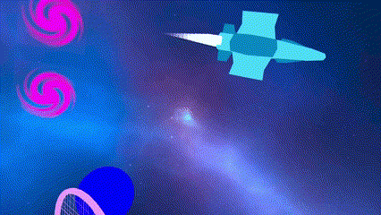
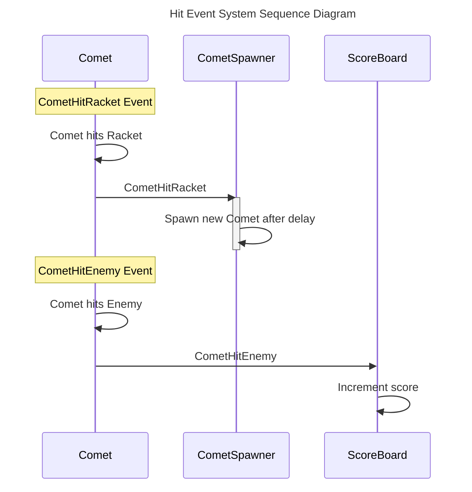
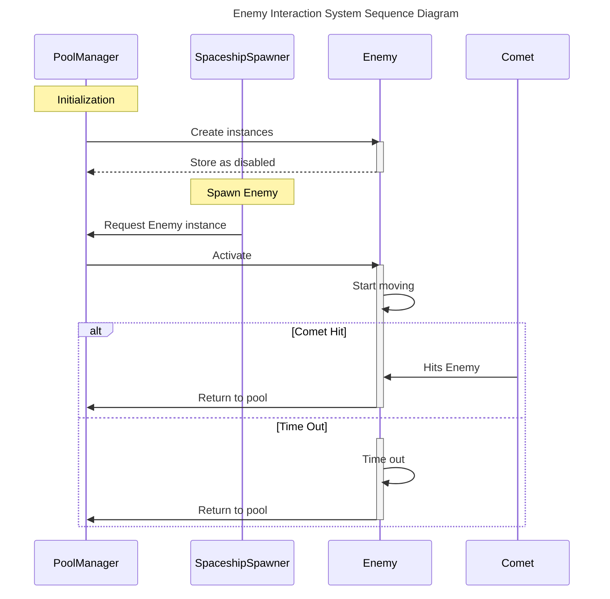
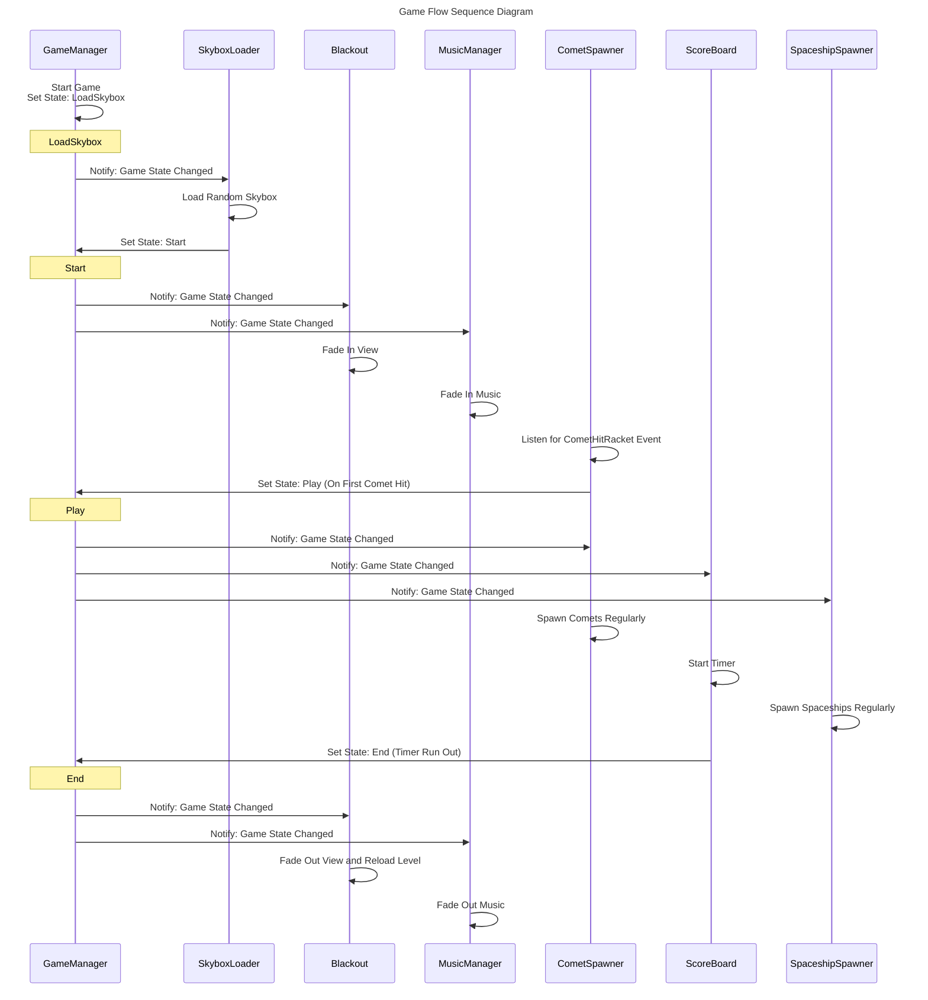

# Space Tennis 100

## Hit Event Sequence Diagram

```mermaid
sequenceDiagram
    participant Comet
    participant CometSpawner
    participant ScoreBoard

    title: Hit Event System Sequence Diagram

    note over Comet: CometHitRacket Event
    Comet->>Comet: Comet hits Racket
    Comet->>CometSpawner: CometHitRacket
    activate CometSpawner
    CometSpawner->>CometSpawner: Spawn new Comet after delay
    deactivate CometSpawner

    note over Comet: CometHitEnemy Event
    Comet->>Comet: Comet hits Enemy
    Comet->>ScoreBoard: CometHitEnemy
    ScoreBoard->>ScoreBoard: Increment score
```

## Enemy Interaction Sequence Diagram

```mermaid
sequenceDiagram
    participant PoolManager
    participant SpaceshipSpawner
    participant Enemy
    participant Comet

    title: Enemy Interaction System Sequence Diagram

    note over PoolManager: Initialization
    PoolManager->>Enemy: Create instances
    activate Enemy
    Enemy-->>PoolManager: Store as disabled
    deactivate Enemy

    note over SpaceshipSpawner: Spawn Enemy
    SpaceshipSpawner->>PoolManager: Request Enemy instance
    PoolManager->>Enemy: Activate
    activate Enemy
    Enemy->>Enemy: Start moving

    alt Comet Hit
        Comet->>Enemy: Hits Enemy
        Enemy->>PoolManager: Return to pool
        deactivate Enemy
    else Time Out
        activate Enemy
        Enemy->>Enemy: Time out
        Enemy->>PoolManager: Return to pool
        deactivate Enemy
    end
```

## Game Flow Sequence Diagram

```mermaid
sequenceDiagram
    participant GameManager
    participant SkyboxLoader
    participant Blackout
    participant MusicManager
    participant CometSpawner
    participant ScoreBoard
    participant SpaceshipSpawner

    title: Game Flow Sequence Diagram

    GameManager->>GameManager: Start Game<br/>Set State: LoadSkybox

    note over GameManager: LoadSkybox

    GameManager->>SkyboxLoader: Notify: Game State Changed
    SkyboxLoader->>SkyboxLoader: Load Random Skybox
    SkyboxLoader->>GameManager: Set State: Start

    note over GameManager: Start

    GameManager->>Blackout: Notify: Game State Changed
    GameManager->>MusicManager: Notify: Game State Changed
    Blackout->>Blackout: Fade In View
    MusicManager->>MusicManager: Fade In Music

    CometSpawner->>CometSpawner: Listen for CometHitRacket Event
    CometSpawner->>GameManager: Set State: Play (On First Comet Hit)

    note over GameManager: Play

    GameManager->>CometSpawner: Notify: Game State Changed
    GameManager->>ScoreBoard: Notify: Game State Changed
    GameManager->>SpaceshipSpawner: Notify: Game State Changed
    CometSpawner->>CometSpawner: Spawn Comets Regularly
    ScoreBoard->>ScoreBoard: Start Timer
    SpaceshipSpawner->>SpaceshipSpawner: Spawn Spaceships Regularly

    ScoreBoard->>GameManager: Set State: End (Timer Run Out)

    note over GameManager: End

    GameManager->>Blackout: Notify: Game State Changed
    GameManager->>MusicManager: Notify: Game State Changed
    Blackout->>Blackout: Fade Out View and Reload Level
    MusicManager->>MusicManager: Fade Out Music
```
